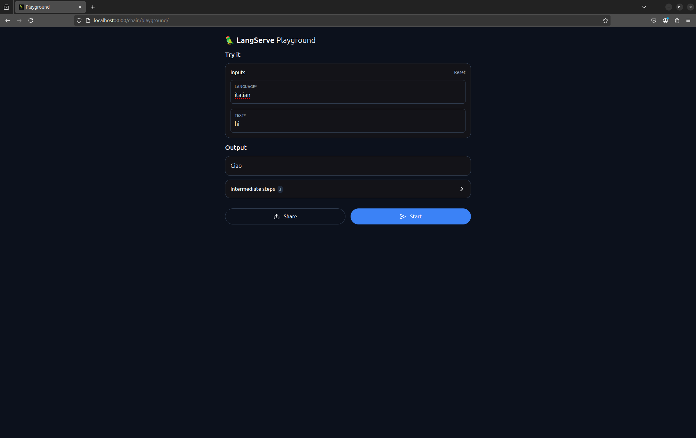

# Simple LLM Application with LangChain

Author: Juliana Briceño

This project is based on a tutorial by [LangChain](https://python.langchain.com/docs/tutorials/llm_chain/), illustrating how to build a basic application using LangChain for language translation.

This repository demonstrates a straightforward LangChain application designed to translate text from English to other languages. The project leverages key LangChain components, such as PromptTemplates, language models, and output parsers, and deploys as a REST API using LangServe. With this setup, users can easily interact with the language model, sending translation requests and retrieving responses.

## Table of Contents
- [Project Structure](#project-structure)
- [Overview](#overview)
- [Architecture and Components](#architecture-and-components)
- [Installation](#installation)
- [Running the Application](#running-the-application)
- [Usage Examples](#usage-examples)
- [Screenshots](#screenshots)

## Project Structure

The structure of this repository is as follows:

```plaintext
.
├── langchainbasicapp.ipynb   # Jupyter Notebook with code examples and explanations
├── langchainclient.py        # Client script for interacting with the server
└── langchainserver.py        # FastAPI server with LangChain integration
```

- **langchainbasicapp.ipynb**: A Jupyter Notebook that contains the code, explanations, and examples of LangChain functionality in action.
- **langchainclient.py**: This Python script functions as a client, allowing users to make requests to the server.
- **langchainserver.py**: This script sets up a FastAPI server that integrates LangChain's translation functionality through LangServe, exposing it as an API endpoint.

## Overview

This LangChain-based application enables users to translate English text into various languages by interacting with a language model, such as OpenAI’s GPT-4. The server is built using FastAPI and serves requests over HTTP, making the translation functionality accessible as a REST API.

The main goals of this project are to:
1. **Showcase LangChain**: Demonstrate the core LangChain components (PromptTemplate, Language Model, OutputParser) in action.
2. **Enable Easy Integration**: Allow users to interact with the translation service easily via REST API.
3. **Serve as a Learning Example**: Provide a foundation for developers looking to build LangChain-based applications with similar functionality.

## Architecture and Components

The architecture centers around LangChain’s integration with FastAPI, supported by LangServe for easy deployment. Key components include:

### 1. **PromptTemplate**
   - The PromptTemplate structures the prompt sent to the language model. This template specifies the expected input format and content, ensuring the prompt aligns with the translation task.
   - In this project, the template provides a translation prompt that instructs the LLM to generate a response in the specified target language.

### 2. **Language Model (LLM)**
   - The language model, such as OpenAI’s GPT-4, performs the core task of translating text. 
   - LangChain provides an abstraction layer, making it easy to work with various LLMs, and we utilize this to interact with the model for translation tasks.

### 3. **OutputParser**
   - The OutputParser parses and processes the raw response from the LLM, ensuring that the output is in a readable, user-friendly format.
   - This component extracts the translated text, formats it as needed, and passes it to the client.

These components are managed and coordinated through LangChain Expression Language (LCEL), which handles the prompt setup, LLM invocation, and output parsing.

## Installation

To set up and run this project on your local machine, follow these steps:

### Step 1: Clone the Repository
First, clone this repository to your local environment.

```bash
git clone https://github.com/bricenojuliana/AREP-LangChainTuto.git
cd AREP-LangChainTuto
```

### Step 2: Install Dependencies
Make sure you have python installed or use the `.venv/` environment.

```bash
python --version
```

The required dependencies include LangChain and LangServe, among other packages. They are in `langchainbasicapp.ipynb` file. Install them using `pip`:

```bash
pip install langchain langserve fastapi
```

### Step 3: Set Up API Keys
If the language model you’re using requires an API key, set it up by adding the required key to your environment variables. This is especially relevant if using OpenAI's API.

```python
import os
os.environ["OPENAI_API_KEY"] = "your_openai_api_key"
```

## Running the Application

### Step 1: Start the FastAPI Server
To launch the server, execute the following command in your terminal:

```bash
python langchainserver.py
```

The server will start running at `http://localhost:8000`. You can then interact with it via HTTP requests or by using the built-in LangServe playground for testing.

### Step 2: Access the LangServe Playground
LangServe provides a useful playground that enables you to test the application without additional code. Navigate to:

```plaintext
http://localhost:8000/chain/playground/
```

This playground interface allows you to input text and choose a target language to see the translation results.

### Step 3: Run Client Interactions
To automate and test interactions, use the provided `langchainclient.py` script. This script allows you to make API requests programmatically and receive translated text.

## Usage Examples

Once the server is running, you can send requests to the API in the following JSON format:

```python
from langserve import RemoteRunnable

# Initialize the remote chain with the server's URL
remote_chain = RemoteRunnable("http://localhost:8000/chain/")

# Make a translation request
response = remote_chain.invoke({
    "language": "italian",
    "text": "hi"
})
print(response)  # Expected output: "ciao"
```


## Screenshots

To provide further clarity, below are example screenshots showcasing the application in action. These screenshots demonstrate both the LangServe playground and sample responses from the API.

### Server running:


### Playground:



### Client:


